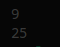
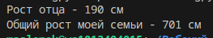
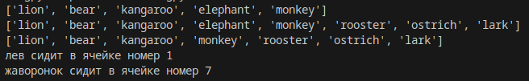

# ЗАДАНИЕ 1

условие:

Составим словарь словарей расстояний между ними
расстояние на координатной сетке - `((x1 - x2) ** 2 + (y1 - y2) ** 2) ** 0.5`

     объяснение решения

1. `for city1 in sites:`: Цикл для перебора каждого города из словаря `sites`.
2. `distances[city1] = {}`: Создание вложенного словаря в `distances` для хранения расстояний от `city1` до других городов.
3. `x1, y1 = sites[city1]`: Извлечение координат текущего города `city1`.
4. `for city2 in sites:`: Вложенный цикл для перебора каждого города из словаря `sites`.
5. `if city1 != city2:`: Условие исключения расстояния от города до самого себя.
6. `x2, y2 = sites[city2]`: Извлечение координат другого города `city2`.
7. `distance = ((x1 - x2) ** 2 + (y1 - y2) ** 2) ** 0.5`: Вычисление расстояния между `city1` и `city2` по формуле расстояния на плоскости по координатам.
8. `distances[city1][city2] = distance`: Заполнение словаря `distances` расстоянием между `city1` и `city2`.
9. Цикл для печати расстояний между всеми парами городов с указанием имени городов и их расстояниями.

# ЗАДАНИЕ 2

         условие

 1. Выведите на консоль значение площади этого круга с точностю до 4-х знаков после запятой
   
2. выведите на консоль True, Или False, если точка лежит вовне круга.

       объяснение решения

1. `if point_1[0]**0.5+point_1[1]**0.5<=radius**0.5:`: Проверяется, лежит ли точка 1 внутри круга по формуле расстояния от начала координат.
2. `print('True')`: Выводится "True", если точка 1 лежит внутри круга, иначе "False".
3. `point_2 = (30, 30)`: Задаются координаты точки 2.
4. Повторяется проверка для точки 2 аналогично точке 1.
5. Производится вывод результата проверки для точки 2.

Этот скрипт вычисляет площадь круга с заданным радиусом и проверяет, лежат ли заданные точки внутри круга с указанным радиусом.

# ЗАДАНИЕ 3

     условие

1. Расставьте знаки операций "плюс", "минус", "умножение" и скобки
 между числами "1 2 3 4 5" так, что бы получилось число "25".

 2. Использовать нужно только указанные знаки операций, но не обязательно все перечесленные.
 3. Порядок чисел нужно сохранить.

        объяснение решения

записываем в переменную result выражение, при коротом ответ должен быть =25
далее через print вывводит результат выражения на экран

# ЗАДАНИЕ 4

     условие

 Выведите на консоль с помощью индексации строки, последовательно:

  первый фильм
  последний
  второй
  второй с конца

2. Запятая не должна выводиться.  Переопределять my_favorite_movies нельзя
3. Использовать .split() или .find()или другие методы строки нельзя - 
4. пользуйтесь только срезами,
как указано в задании!

       объяснение решения

выводим на экран слова через срезы

# ЗАДАНИЕ 5

     условие

1. Создайте списки:

моя семья (минимум 3 элемента, есть еще дедушки и бабушки, если что)
2. Выведите на консоль рост отца в формате
Рост отца - ХХ см
3. Выведите на консоль общий рост вашей семьи как сумму ростов всех членов
Общий рост моей семьи - ХХ см

       объяснение решения

1. записываем в список в каждую ячейку имя и рост членов семьи. 
2. Вывод строки "Рост отца -" и роста отца из списка `my_family_height`, который находится во втором элементе (индекс `[1]`) и втором значении (индекс `[1]`) внутреннего списка. `"см"` - это просто текст, который выводится вместе с ростом отца.
3. Вычисление суммы ростов всех членов семьи путем сложения ростов отца и каждого из трех детей. Результат сохраняется в переменной `summa_rostov`.
4.`print('Общий рост моей семьи -',summa_rostov,"см" )`: Вывод на консоль строки "Общий рост моей семьи -" и значения переменной `summa_rostov`, которое представляет собой сумму ростов всех членов семьи.

# ЗАДАНИЕ 6

       условие

 1. есть список животных в зоопарке
 2. посадите медведя (bear) между львом и кенгуру
3. выведите список на консоль
4. добавьте птиц из списка birds в последние клетки зоопарка
5. и выведите список на консоль
6. выведите на консоль в какой клетке сидит лев (lion) и жаворонок (lark).
Номера при выводе должны быть понятны простому человеку, не программисту.

       объяснение решения

1. при помощи метода insert мы добавляем в 1 ячейку "bear"
2. при помощи метода extend добавляем в конец списка "birds"
3. при помощи метода remove удаляем из списка "elephant"
4. Создается переменная `kom` и ей присваивается значение 1
5. Проверяется условие: если текущий элемент `i` равен строке "lion".
6. Если выполняется условие из предыдущей строки, то выводится сообщение, указывающее, что лев сидит в ячейке с номером `kom`.
7. Проверяется условие: если текущий элемент `i` равен строке "lark".
8. Если выполняется условие из предыдущей строки, то выводится сообщение, указывающее, что жаворонок сидит в ячейке с номером `kom`.
9. Увеличивается значение переменной `kom` на 1. Это позволяет отслеживать номер ячейки, в которой находится определенное животное в списке `zoo`.
  

# ЗАДАНИЕ 7

        условие

        Есть список песен группы Depeche Mode со временем звучания с точностью до долей минут
Точность указывается в функции round(a, b), где a, это число которое надо округлить, а b количество знаков после запятой
1. распечатайте общее время звучания трех песен: 'Halo', 'Enjoy the Silence' и 'Clean' в формате
Три песни звучат ХХХ.XX минут
 Обратите внимание, что делать много вычислений внутри print() - плохой стиль.
Лучше заранее вычислить необходимое, а затем в print(xxx, yyy, zzz)
2.  распечатайте общее время звучания трех песен: 'Sweetest Perfection', 'Policy of Truth' и 'Blue Dress'
А другие три песни звучат ХХХ минут

        объяснение решения

1.Создается переменная `z`, в которую сохраняется сумма времени воспроизведения трех песен: 'Halo', 'Enjoy the Silence' и 'Clean' из списка `vist`.
2.Получаем время воспроизведения песен с различными индексами из списка `vist` и берем определенный элемент из этого списка, который представляет длительность песни.
3. Выводим на экран, сколько минут длится общее время звучания трех песен: 'Halo', 'Enjoy the Silence' и 'Clean'.
4. Создается переменная `g`, в которую сохраняется сумма времени воспроизведения трех других песен: 'Sweetest Perfection', 'Policy of Truth' и 'Blue Dress' из словаря `vict`.
5. Затем эти времена суммируются, и результат округляется до двух десятичных знаков.

# ЗАДАНИЕ 8

      условие

Есть зашифрованное сообщение
1. Нужно его расшифровать и вывести на консоль в удобочитаемом виде.
2. Должна получиться фраза на русском языке, например: как два байта переслать.

       объяснение решения

берем из списка нужную нам букву при помощи срезов и выводим каждую букву на экран

# ЗАДАНИЕ 9

      условие
в саду сорвали цветы
2. создайте множество цветов, произрастающих в саду и на лугу
garden_set =
meadow_set =
2. выведите на консоль все виды цветов
3. выведите на консоль те, которые растут и там и там
4. выведите на консоль те, которые растут в саду, но не растут на лугу
5. выведите на консоль те, которые растут на лугу, но не растут в саду

     объяснение решения

1. выводим на экран все виды цветов с луга и сада.
2. инициируем цикл `for`, который будет проходить по каждому элементу `i` в множестве `garden_set`.
3. на 32 и 39 строке проверяется, содержится ли значение переменной `i` в множестве `meadow_set`. Если значение переменной `i` не содержится в `meadow_set`, условие выполняется и наоборот.
4. Если элемент `i` из `garden_set` также содержится в `meadow_set`, то этот элемент будет выведен с помощью функции `print()`.
   

 # ЗАДАНИЕ 10

       условие

есть словарь магазинов с распродажами
1. Создайте словарь цен на продкты следующего вида (писать прямо в коде)
2. Указать надо только по 2 магазина с минимальными ценами

       объяснение решения

1. Создается словарь sweets, в котором ключами являются названия сладостей (печенье, конфеты, карамель, пирожное).
2. Из словаря магазинов с распродажами берутся минимальные цены каждой сладости.
3. в новом словаре выписываем только 2 магазина каждой сладости с самой минимальной ценой.

   
 # ЗАДАНИЕ 11

       условие

Есть словарь кодов товаров
Есть словарь списков количества товаров на складе.
1. Рассчитать на какую сумму лежит каждого товара на складе
2. Вывести стоимость каждого вида товара на складе:
один раз распечать сколько всего столов и их общая стоимость,
один раз распечать сколько всего стульев и их общая стоимость,
и т.д. на складе
Формат строки <товар> - <кол-во> шт, стоимость <общая стоимость> руб

1. Мы определяем переменную `table_code`, присваивая ей значение кода товара из словаря товаров `goods` для товара "Стол".
2. Затем находим информацию о первом столе в словаре `store` с помощью кода товара и индекса `[0]` и сохраняем эту информацию в переменную `tables_item`.
3. Вычисляем переменные `tables_quantity` и `tables_price`, равные количеству и цене первого стола.
4. Рассчитываем общую стоимость столов, умножив количество на цену и присваиваем результат переменной `table_cost`.
5. Затем повторяем шаги 2-4 для второго стола и сохраняем данные в соответствующие переменные.
6. Выводим общее количество столов и их общую стоимость.
7. Повторяем все эти шаги для дивана и стульев, чтобы найти общее количество каждого товара и их общую стоимость.

